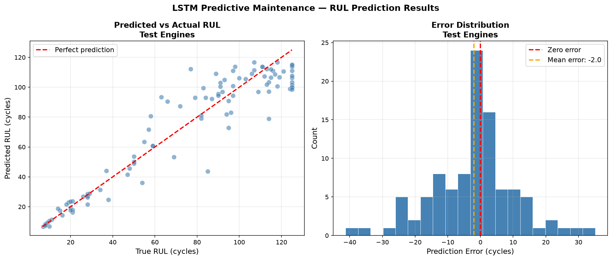
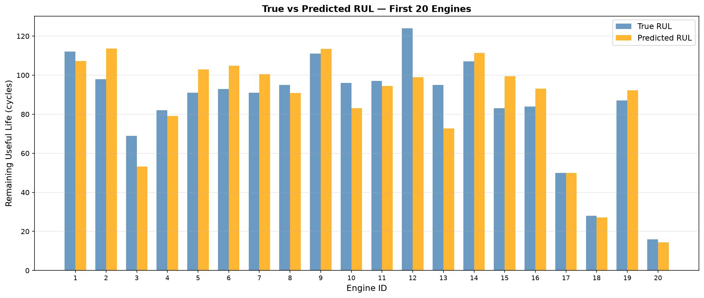

# Predictive Maintenance System — Remaining Useful Life Prediction

An LSTM neural network that predicts Remaining Useful Life (RUL) of industrial equipment from time series sensor data — enabling maintenance teams to schedule repairs before failures occur rather than reacting after the fact.

Built to demonstrate production-grade time series ML engineering for industrial IoT and manufacturing operations — directly applicable to generators, pumps, motors, and rotating equipment with sensor telemetry.

---

## Results

| Metric | Score | Meaning |
|---|---|---|
| RMSE | **12.99 cycles** | Average prediction error |
| MAE | **9.36 cycles** | Median prediction error |
| R² Score | **0.8949** | Model explains 89.5% of RUL variance |
| Within ±10 cycles | **61%** | High precision predictions |
| Within ±20 cycles | **86%** | Strong scheduling accuracy |
| Within ±30 cycles | **96%** | Reliable maintenance windows |

### Per-Range Performance

| RUL Range | RMSE | Significance |
|---|---|---|
| 0-30 cycles | **2.64** | Most accurate near failure — when it matters most |
| 30-60 cycles | 10.01 | Strong mid-range performance |
| 60-90 cycles | 21.36 | Acceptable early degradation |
| 90-125 cycles | 11.88 | Good early detection |

The model is most precise when equipment is closest to failure — the critical window for maintenance scheduling.

---

## Demo



*Left: Predicted vs actual RUL scatter plot — points close to the red line indicate accurate predictions. Right: Error distribution centered near zero showing balanced predictions.*



*True vs predicted RUL for the first 20 test engines — orange bars closely track blue bars across the full RUL range.*

---

## Business Context

In industrial manufacturing unexpected equipment failure is costly:
- **Unplanned downtime** — production line stops, emergency repairs, lost revenue
- **Over-maintenance** — replacing parts too early wastes budget
- **Predictive maintenance** — replace parts at exactly the right time based on sensor data

This system gives operations teams a reliable maintenance window:

- **IMMEDIATE** — RUL ≤ 20 cycles — schedule maintenance now
- **SOON** — RUL 21-50 cycles — plan maintenance window
- **MONITOR** — RUL > 50 cycles — continue normal operations

**96% of predictions fall within 30 cycles of the true RUL** — reliable enough to drive real maintenance scheduling decisions.

---

## Architecture

```
30 cycles of sensor readings (14 sensors)
            ↓
Sensor normalization (MinMaxScaler)
            ↓
Sliding window sequence (30 × 14 tensor)
            ↓
LSTM Layer 1 (hidden size: 128)
            ↓
LSTM Layer 2 (hidden size: 128)
            ↓
Take last time step output
            ↓
Fully connected: 128 → 64 → 32 → 1
            ↓
Predicted RUL (cycles)
            ↓
FastAPI REST response with urgency classification
```

---

## Tech Stack

- **Model:** LSTM neural network — PyTorch
- **Architecture:** 2-layer LSTM with 216,193 parameters
- **Training:** MSE loss, Adam optimizer, gradient clipping, weight decay
- **Regularization:** Dropout, weight decay, gradient clipping, learning rate scheduling
- **API:** FastAPI with automatic Swagger documentation
- **Containerization:** Docker
- **CI/CD:** GitHub Actions — automated testing and Docker build on every push
- **Dataset:** NASA CMAPSS Turbofan Engine Degradation Dataset (FD001)

---

## Project Structure

```
predictive-maintenance/
├── src/
│   ├── data_prep.py      # Data loading, RUL calculation, sequence creation
│   ├── model.py          # LSTM architecture definition
│   ├── train.py          # Training loop with checkpointing
│   └── evaluate.py       # Metrics, visualizations, per-range analysis
├── api/
│   └── main.py           # FastAPI REST endpoints
├── tests/
│   └── test_api.py       # Automated test suite
├── outputs/              # Generated visualizations
├── models/               # Saved model weights
├── Dockerfile            # Container definition
├── requirements.txt      # Python dependencies
└── .github/workflows/    # CI/CD pipeline
    └── ci.yml
```

---

## API Endpoints

| Method | Endpoint | Description |
|---|---|---|
| GET | `/` | Health check |
| GET | `/health` | Detailed health status |
| POST | `/predict` | Predict RUL for single equipment unit |
| POST | `/predict/batch` | Batch RUL prediction summary |
| GET | `/model/info` | Model architecture and performance |

### Sample Response

```json
{
  "unit_id": 42,
  "predicted_rul": 23.4,
  "rul_category": "Plan maintenance window in the near term",
  "urgency": "SOON",
  "recommendation": "Schedule maintenance within the next 50 cycles. Begin procurement of replacement parts.",
  "confidence_note": "Model RMSE: 12.99 cycles. 96% of predictions within ±30 cycles.",
  "latency_ms": 12.3,
  "model_version": "LSTM-v1.0"
}
```

---

## Quick Start

### Run locally

```bash
# Clone the repository
git clone https://github.com/PiotrWarchol/predictive-maintenance.git
cd predictive-maintenance

# Install dependencies
pip install -r requirements.txt

# Start the API
python api/main.py

# Open interactive docs
# http://localhost:8000/docs
```

### Run with Docker

```bash
# Build the image
docker build -t predictive-maintenance .

# Run the container
docker run -p 8000:8000 predictive-maintenance

# API available at http://localhost:8000
```

---

## Model Training

### Dataset
- **Source:** NASA CMAPSS Turbofan Engine Degradation Simulation Dataset
- **Subset:** FD001 — single operating condition, single fault mode
- **Training engines:** 100 engines run to failure
- **Test engines:** 100 engines with unknown RUL
- **Sequences:** 17,731 training sequences of 30 cycles each
- **Sensors used:** 14 of 21 sensors — constant sensors removed

### Data Pipeline
1. Load raw sensor readings for 100 training engines
2. Calculate RUL for each cycle — max cycle minus current cycle
3. Clip RUL at 125 — piecewise linear degradation model
4. Normalize sensors using MinMaxScaler fitted on training data
5. Create sliding window sequences of length 30
6. Each sequence predicts RUL at the final time step

### Training Configuration
- **Loss function:** MSE — penalizes large prediction errors
- **Optimizer:** Adam with weight decay 1e-5
- **Learning rate:** 0.001 with ReduceLROnPlateau scheduler
- **Gradient clipping:** threshold 1.0 — prevents exploding gradients
- **Dropout:** 0.2 in LSTM and fully connected layers
- **Epochs:** 50 with best model checkpointing
- **Best epoch:** 15 — RMSE 12.99 cycles

### Training Results

| Epoch | Train Loss | Test RMSE |
|---|---|---|
| 1 | 2938 | 41.22 |
| 5 | 287 | 13.73 |
| 15 | 217 | **12.99** ← best |
| 50 | 139 | 15.11 |

---

## Why RUL Prediction Matters for Manufacturing

Traditional maintenance approaches:

- **Reactive maintenance** — fix it when it breaks. Expensive downtime, emergency labor costs
- **Preventive maintenance** — replace on a fixed schedule. Parts replaced too early or too late
- **Predictive maintenance** — replace based on actual equipment condition. Optimal timing, minimal waste

This system enables predictive maintenance by continuously monitoring sensor telemetry and predicting exactly when each unit will need service — giving operations teams reliable lead time to plan parts procurement, schedule technicians, and minimize production impact.

**Applicable equipment:**
- Power generators
- Industrial pumps
- Electric motors
- Air compressors
- Gas turbines
- CNC machine spindles
- Conveyor systems

---

## Key Technical Decisions

**Why LSTM over standard neural networks?**
Sensor data is sequential — what happened in the last 30 cycles matters for predicting the next failure. LSTM networks are specifically designed to learn temporal patterns in time series data, capturing degradation trends that feedforward networks miss.

**Why clip RUL at 125 cycles?**
Engines don't degrade meaningfully until they approach failure. The piecewise linear model treats all engines as equally healthy above 125 cycles and focuses learning on the degradation phase. This significantly improves model performance in the critical low-RUL range.

**Why gradient clipping?**
LSTM networks are prone to exploding gradients when backpropagating through 30 time steps. Clipping at 1.0 prevents training instability without limiting the model's learning capacity.

**Why the best checkpoint rather than final epoch?**
The model showed slight overfitting after epoch 15 — train loss continued decreasing while test RMSE increased. Checkpointing the best test RMSE ensures the deployed model generalizes to unseen equipment rather than memorizing training engine patterns.

---

## Related Projects

- [Manufacturing Defect Detection](https://github.com/PiotrWarchol/defect-detection) — ResNet18 computer vision achieving 99.86% accuracy on casting defect inspection
- [Baseball RAG Assistant](https://github.com/PiotrWarchol/baseball-rag-assistant) — Production RAG pipeline with LangChain, ChromaDB, and Azure deployment
- [Tool Review Sentiment Classifier](https://github.com/PiotrWarchol/tool-sentiment-classifier) — DistilBERT fine-tuning achieving 89.5% accuracy on 50,000 reviews

---

## Author

**Piotr Warchol**
Software Engineer | MS Computer Science — AI Concentration
[GitHub](https://github.com/PiotrWarchol)